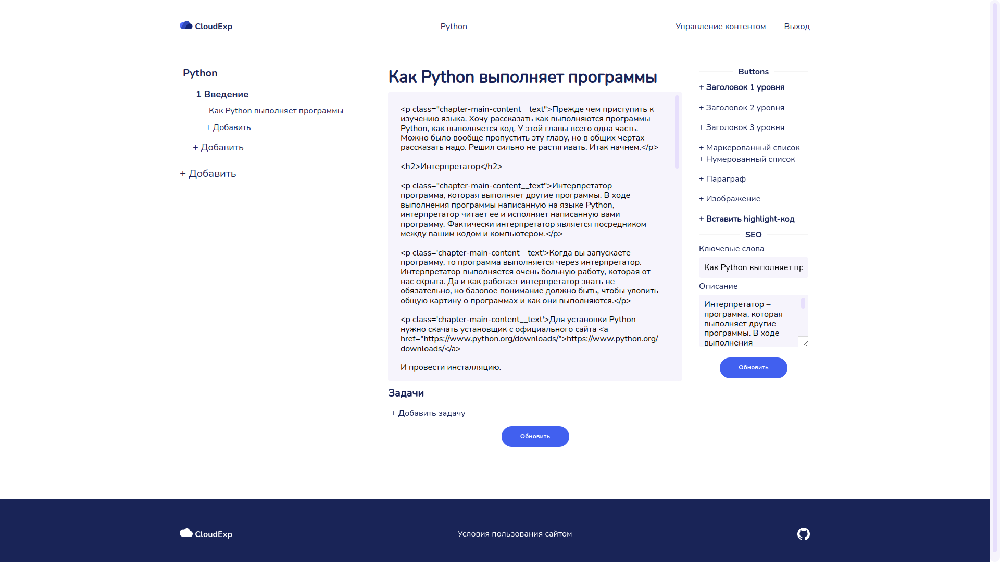

# Cloud Experience for everyone

It's basic implement education project with admin panel on Flask microframework.
It's my pet project. This project is demonstration now.

**Maybe the project will have a future.**

Take a look at the following images to give you an idea of what it looks like.

* Main page

* Admin page

* Chapter's page

and etc.

#### How to install and run

* Build project
`docker-compose up`
* First setting for project
````bash
docker exec -it cloudexp_backend_1 sh
docker flask start create_db
docker flask start create_superuser yourlogin yourpassword youremail
````
* So you can to see how the project is working, just open in browser `127.0.0.1`
